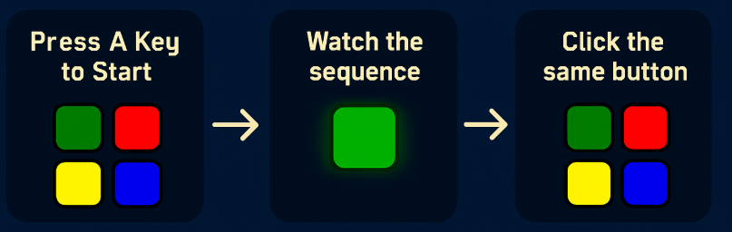

# 🎮 Simon Game – A Journey of Learning Through Play  

When I first started exploring **JavaScript**, I didn’t just want to write lines of code—I wanted to **see code come alive**.  
So, I challenged myself to build something fun, visual, and interactive: the **Simon memory game**.  

This wasn’t just about making a game. It was about understanding **how the browser thinks**, how logic can shape interactions, and how tiny bugs can teach big lessons.  

---

## 📖 The Story Behind It  

- 🔍 **Curiosity** – How can a browser “remember” a sequence like humans do?  
- 🛠️ **Experimentation** – Arrays stored the patterns, functions broke the game into steps.  
- 🎨 **Making it Real** – I added colors, sounds, and animations so it felt alive.  
- 🐞 **Challenges** – Timing issues, mismatched patterns, sounds failing on some browsers.  
- ✅ **Breakthroughs** – With `setTimeout`, array comparisons, and jQuery effects, the logic finally clicked into place.  

This project became my **gateway into web development**—where logic met creativity. 

---

## 🎯 Gameplay

<p align="center">
  
</p>

---
## 🚀 Live Demo  

<p align="center">
  <a href="https://kishore3002.github.io/Simon_game/" target="_blank">
    
  </a>
</p>

---

## 🛠️ Tech Stack

<p align="left">
  
  
  
  
</p>

---

## 📁 Project Structure
```
Simon_game/
├── index.html          # Game interface
├── styles.css          # Styling and animations
├── game.js            # Game logic
├── sounds/            # Audio files (included)
│   ├── blue.mp3
│   ├── green.mp3
│   ├── red.mp3
│   ├── yellow.mp3
│   └── wrong.mp3
└── README.md
```

## 🎓 What I Learned

### **JavaScript Fundamentals**
- **Arrays**: Managing game patterns and user input sequences
- **Functions**: Breaking down complex logic into smaller, reusable pieces
- **Event Listeners**: Handling keyboard and mouse interactions
- **Conditionals**: Checking user answers against correct patterns

### **jQuery Skills**
- **Selectors**: Targeting specific elements efficiently
- **Event Handling**: Click and keydown event management
- **Animations**: fadeIn/fadeOut effects for visual feedback
- **Class Manipulation**: Adding/removing CSS classes dynamically

### **Problem-Solving Process**
1. **Understanding the Game**: Broke down Simon Says into core mechanics
2. **Planning the Logic**: Mapped out the sequence validation algorithm
3. **Building Incrementally**: Started with basic clicks, then added patterns
4. **Debugging**: Fixed timing issues and sequence validation bugs
5. **Polish**: Added sounds, animations, and game over states

## 🔍 Key Code Concepts

**Pattern Matching Logic:**
```javascript
function checkAnswer(currentLevel) {
    if(gamePattern[currentLevel] === userClickedPattern[currentLevel]) {
        // User got it right - continue or next level
    } else {
        // Wrong answer - game over
    }
}
```

**Random Sequence Generation:**
```javascript
var randomNumber = Math.floor(Math.random() * 4);
var randomChosenColour = buttonColours[randomNumber];
gamePattern.push(randomChosenColour);
```

## 🚀 Quick Start

### **Step-by-Step Setup**

**1. Clone the repository:**
```bash
git clone https://github.com/kishore3002/Simon_game.git
```

**2. Navigate to the project folder:**
```bash
cd Simon_game
```

**3. Open the game:**
```bash
# For Mac users:
open index.html

# For Windows users:
start index.html
```

**4. Start playing!**
- Press any key to begin
- Watch the pattern and repeat it by clicking the colored buttons

### **Alternative: Direct Download**
1. Click the green "Code" button on GitHub
2. Select "Download ZIP"
3. Extract the files
4. Double-click `index.html` to open in your browser

No installation or dependencies required - everything is included!

## 🎨 Features I Implemented

- **Visual Feedback**: Buttons light up when pressed or during computer sequence
- **Audio Integration**: Each color has its own sound using Web Audio API
- **Game State Management**: Tracking levels, patterns, and user progress
- **Responsive Design**: Works on desktop and mobile devices
- **Error Handling**: Graceful game over with restart functionality

## 🐛 Challenges I Solved

**Timing Issues**: Getting the computer sequence to display at the right pace
- *Solution*: Used setTimeout and jQuery animations with proper delays

**Pattern Validation**: Checking user input against the correct sequence
- *Solution*: Compared arrays element by element as user clicks

**State Management**: Keeping track of game progress and user input
- *Solution*: Used global variables to maintain game state across functions

**Audio Loading**: Making sure sounds play reliably across browsers
- *Solution*: Created new Audio objects for each sound play

## 🎯 Skills Developed

- **DOM Manipulation**: Changing content and styles dynamically
- **Event-Driven Programming**: Responding to user interactions
- **Algorithm Thinking**: Creating step-by-step logic for game mechanics
- **Debugging**: Using console.log and browser tools to fix issues
- **Code Organization**: Keeping functions focused and readable

## 🔄 Possible Improvements

- Add difficulty levels (faster/slower sequences)
- Local storage for high scores
- Better mobile touch handling
- More visual effects and animations

## 🎮 Play the Game

This was a fun project that taught me how user interactions, visual feedback, and game logic come together in web development. Each function handles a specific part of the game, making the code easy to understand and modify.

---

*A learning project focused on JavaScript fundamentals and interactive web development.*
